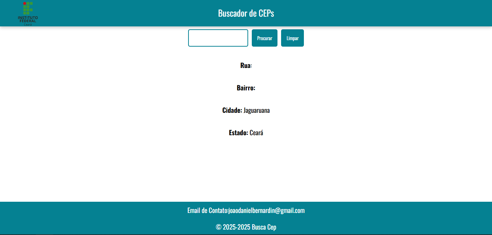

# Projeto buscador de CEPs

O objetivo do projeto é pesquisar CEP via uma API chamada https://viacep.com.br

## Design do projeto



## API utilizada

A API https://viacep.com.br retorna as seguintes informaçoes para um cep exemplo 62823000

```
// https://viacep.com.br/ws/61652062/json/
{
  "cep": "61652-062",
  "logradouro": "Rua 3",
  "complemento": "(Lot Esplanada Araturi)",
  "unidade": "",
  "bairro": "Araturi (Jurema)",
  "localidade": "Caucaia",
  "uf": "CE",
  "estado": "Ceará",
  "regiao": "Nordeste",
  "ibge": "2303709",
  "gia": "",
  "ddd": "85",
  "siafi": "1373"
}
```
## Funcionalides
- [x] Busca de CEP
- [x] Limpar Dados
- [x] Melhorar o Design
- [] Responsividade
- [x] Rodapé
## Observaçoes
> [!NOTE]
> Projeto feito na diciplina de web 1 no curso de ADS do IFCE de Jaguaruana

> [!TIP]
> Não usar hífen na hora de colocar o CEP

> [!IMPORTANT]
> ALguns CEPs podem não conter todas as informações 
## Contatos
Email: joaodanielbernardin@gmail.com
